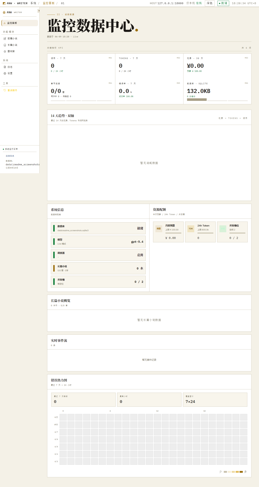
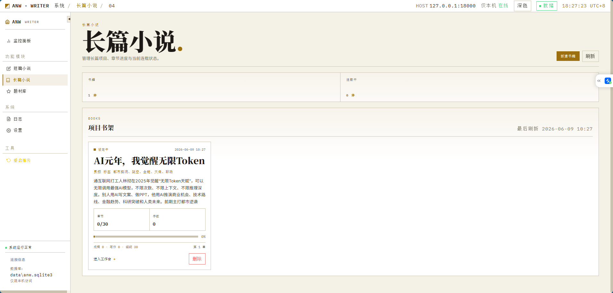
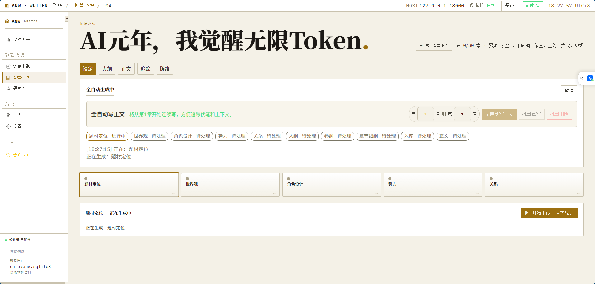
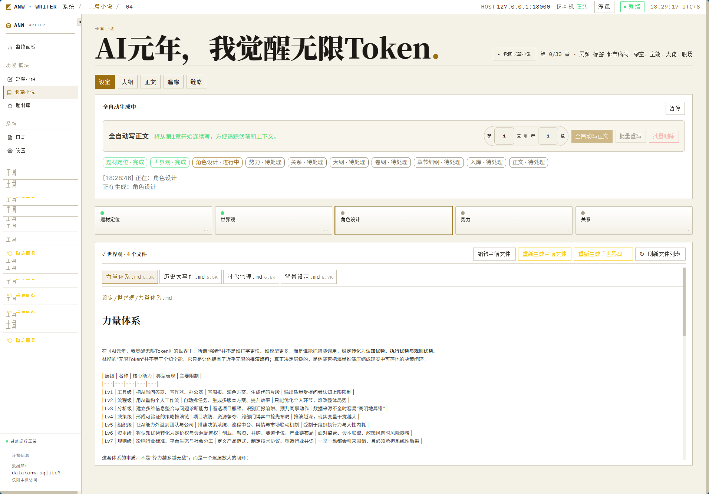
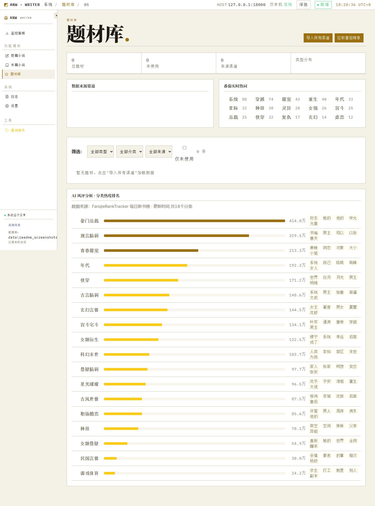

# ANW（Auto Novel Writer）本地小说创作与审核工作台

ANW 是 Auto Novel Writer 的缩写，是一个本地优先的小说创作、审核和管理工作台。它面向短篇小说与长篇小说的持续生产流程，提供本地 Web 界面、题材管理、多阶段生成、AI 审查、人工复核、日志查看、预算控制和 SQLite 队列。

当前范围：本地生成、本地审核、本地管理。项目不托管平台账号，不处理第三方网页登录态，也不内置外部检测服务。

## 界面预览

### 监控数据中心

<a href="docs/images/readme-dashboard.png">
  
</a>

### 长篇小说工作区

<a href="docs/images/readme-long-novel-books.png">
  
</a>
<a href="docs/images/readme-long-novel-generating.png">
  
</a>
<a href="docs/images/readme-long-novel-worldview.png">
  
</a>

### 题材库

<a href="docs/images/readme-theme-pool.png">
  
</a>

## 快速启动

Windows 双击或在命令行运行：

```bat
start_anw.bat
```

PowerShell 也可以运行：

```powershell
.\start_anw.ps1
```

启动脚本会检查并创建 `.venv`，安装 `requirements.txt`，初始化 `data/`、`logs/` 和 SQLite 数据库，然后启动本地管理界面。

默认访问地址：

```text
http://127.0.0.1:8000
```

如果端口被占用：

```bat
set ANW_REVIEW_PORT=18000
start_anw.bat
```

也可以直接启动 Web 服务：

```bash
python -m review_queue.human_review
python -m review_queue.human_review --port 18000
```

## 本地开发

建议使用 Python 3.11+。

```bash
python -m venv .venv
.venv\Scripts\activate
pip install -r requirements.txt
```

没有真实模型 API key 时，ANW 会走 mock / dry-run 路径，方便在本地验证流程、界面和数据库写入。

## 配置

默认读取 `config.yaml`，也可以用 `ANW_CONFIG` 指向私有配置文件：

```bash
set ANW_CONFIG=D:\secure\anw-config.yaml
```

敏感字段建议来自私有配置文件或环境变量，不要提交到仓库：

```bash
set DEEPSEEK_API_KEY=your_api_key
```

常用配置项：

```yaml
deepseek:
  api_key: ""
  mock: true
runtime:
  dry_run: true
database:
  sqlite_path: "data/anw.sqlite3"
  backup_dir: "data/backups"
logging:
  file: "logs/anw.log"
```

常用环境变量：

- `ANW_REVIEW_PORT`：本地 Web 服务端口。
- `ANW_CONFIG`：配置文件路径。
- `ANW_SQLITE_PATH`：SQLite 数据库路径。
- `ANW_DRY_RUN`：强制 dry-run。
- `ANW_MOCK_DEEPSEEK`：强制 mock 模型调用。
- `ANW_AI_REVIEW_THRESHOLD`：AI 审查通过阈值。
- `ANW_MAX_REWRITE_ATTEMPTS`：自动重写次数上限。
- `ANW_MONTHLY_BUDGET_CNY`：月度预算上限。
- `ANW_DAILY_TOKEN_LIMIT`：每日 token 上限。

## 功能流程

### 短篇小说

短篇小说流程从题材库开始，经过选题、故事框架、大纲、分节生成、精修、去 AI 味和分章标题等阶段，最终进入审核与人工复核。

命令行生成单篇：

```bash
python -m cli.generate
```

本地界面中可以查看阶段产物、失败原因、重试记录、审查意见和最终稿。

### 长篇小说

长篇小说流程以项目为单位管理。你可以创建题材方向，生成世界观、角色、势力、关系、大纲、卷纲、章节细纲和正文草稿，并持续维护长期记忆与章节状态。

本地界面入口命名为“长篇小说”，用于管理长篇项目、查看章节进度、继续生成和进入人工复核。

### 审核与复核

ANW 的审核流程保留在本地项目内：

- AI 审查：按情节、人物、节奏、语言、原创性、安全性和平台适配度给出结构化评分。
- 自动重写：在阈值未达标时按配置尝试局部改写。
- 人工复核：所有关键稿件仍可进入人工批准、拒绝或备注。
- 日志与指标：本地记录 API 使用、阶段事件、失败原因和队列状态。

## 本地界面

ANW 本地管理界面包含：

- 监控：首页查看队列、审查、成本、失败任务和系统状态。
- 题材库：管理短篇与长篇题材。
- 短篇小说：运行短篇生成流程并查看阶段产物。
- 长篇小说：管理长篇项目、设定、大纲、章节和正文。
- 审核队列：查看 AI 审查结果并进行人工复核。
- 控制台：调整流程步骤、提示词和运行状态。
- 设置：编辑配置、环境变量、模型参数、预算和系统选项。
- 日志：查看后端运行日志和事件记录。

## 数据与安全边界

- 数据库默认保存到 `data/anw.sqlite3`。
- 日志默认保存到 `logs/anw.log`。
- 截图与运行证据默认保存到 `logs/screenshots/`。
- API key 和私有路径请通过环境变量或本地私有配置注入。
- 不要提交 `.env`、本地数据库、日志、截图、浏览器状态或真实稿件数据。
- 项目不尝试绕过验证码、滑块、人机验证或任何平台安全机制。

## 开源说明

本项目以 MIT License 开源，详见 [LICENSE](LICENSE)。你可以自由使用、复制、修改、合并、发布和分发本项目代码，但需要保留原始版权与许可声明。

欢迎基于本仓库提交 issue 或 pull request。提交前请确保不包含 API key、账号凭据、本地数据库、日志、真实稿件或其他隐私数据；涉及模型供应商、内容平台或外部服务的能力应以可关闭、可配置的方式实现，并在 README 或相关文档中说明安全边界。

## 测试

运行完整测试：

```bash
pytest -q
```

编译核心 Python 包：

```bash
python -m py_compile (Get-ChildItem generator,review_queue,cli -Recurse -Filter *.py).FullName
```

检查旧品牌和外部检测残留时，可以按项目约定使用 `rg` 做全仓库扫描。

```bash
rg -n "需要审计的关键词"
```
